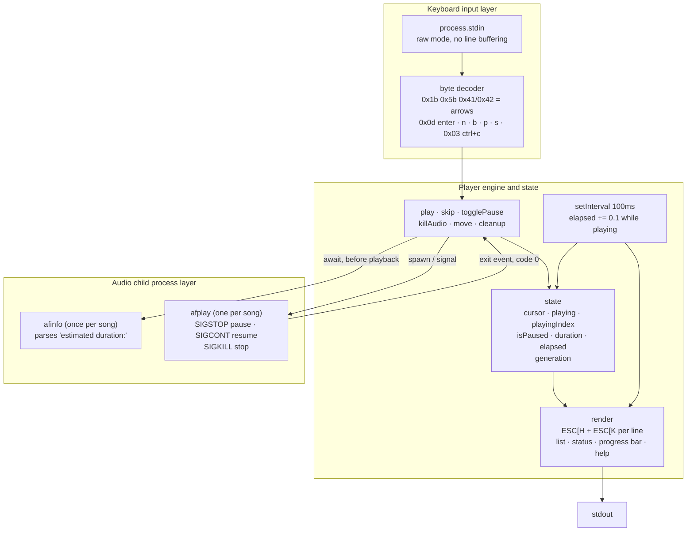
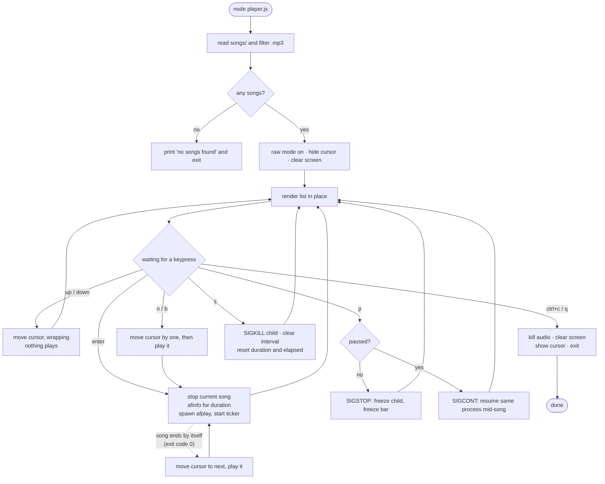

# Terminal Audio Player

A music player that lives entirely in your terminal. It scans the local `songs/`
folder, draws the track list in place, and plays the highlighted song with a
moving progress bar — no browser, no GUI, one file of Node.

```
Terminal Audio Player

> 1. sample-15s.mp3 (playing)
  2. sample-3s.mp3
  3. sample-9s.mp3

playing: sample-15s.mp3
[############--------------------------------------]  24%  0:04 / 0:19

up/down  move cursor      enter  play highlighted
n/b      next/previous    p      pause or resume
s        stop             ctrl+c quit
```

## Run

```bash
node player.js      # or: npm start
```

Drop your `.mp3` files into the `songs/` directory first. If the folder is
empty the player says so and exits instead of drawing an empty list.

## Keys

| Key | What it does |
| --- | --- |
| `↑` / `↓` | Move the cursor. Never starts playback. |
| `enter` | Play the highlighted song. |
| `n` / `b` | Next / previous: moves the cursor **and** plays it. Wraps around. |
| `p` | Pause, or resume from the exact point it froze. |
| `s` | Stop: kills the audio process and resets to the start of the song. |
| `ctrl+c` / `q` | Quit, killing any audio and restoring the terminal. |

When a song ends on its own the player advances to the next one automatically
and keeps going, wrapping at the end of the list.

## Prerequisites

- **macOS.** Playback uses `afplay` and duration comes from `afinfo`, both of
  which ship with the OS. There is nothing to install, but there is also no
  Linux or Windows fallback — on those platforms you would swap the two
  `spawn` calls for `ffplay`/`ffprobe`.
- **Node.js 14+** (developed on v22). Only `fs`, `path` and `child_process`
  are used — no dependencies.
- **A real terminal.** The player needs a TTY for raw-mode keypresses, so it
  will not run with its input piped from another process.

## Architecture



## User flow



## What I learned

**The list kept reprinting.** `console.log` only ever appends, so every
keypress pushed a fresh copy of the list down the screen. The fix is ANSI
escape codes: `\x1b[H` moves the cursor to the top-left corner so the next
write lands on top of the old frame instead of below it.

**Moving the cursor is not the same as clearing.** Homing the cursor and
writing over the frame leaves the tail of any line that got *shorter* — going
from `sample-15s.mp3 (playing)` to `sample-15s.mp3` left a ghost `(playing)`
behind, because nothing erased those columns. Each line ends with `\x1b[K`
(clear to end of line) and the frame ends with `\x1b[J` (clear everything
below). Clearing the whole screen with `\x1b[2J` first would also work, but at
ten repaints a second it blanks and repaints visibly — it flickers. Clearing
per line as you overwrite it does not.

**Raw mode means you own ctrl+c.** `setRawMode(true)` is what delivers
keystrokes instantly instead of a line at a time, but it also stops the
terminal turning ctrl+c into SIGINT — it arrives as plain byte `0x03`. Without
handling that byte yourself the app cannot be quit.

**`afplay` has no pause.** It is a fire-and-forget binary with no control
channel, so the choice was VLC's remote-control interface (`--intf rc`, write
`pause\n` to its stdin) or pausing the process at the OS level with `SIGSTOP`
and `SIGCONT`. The signals won: no 100MB dependency, no command protocol to
keep in sync, and because the process is frozen mid-buffer rather than seeking,
resume continues from the exact sample it stopped on. The one gotcha is that a
stopped process still has to be killable — `SIGKILL` gets through where a
caught signal would not.

**Stacked intervals run the timer fast.** Elapsed time is counted by hand,
`+= 0.1` every 100ms, because the player cannot be asked where it is. Starting
a new song without `clearInterval` on the old one leaves both intervals alive
and the counter climbs at double speed — then triple, on the next song. Every
new song clears the previous ticker first.

**Switching songs needs a whole checklist, not just a kill.** Each switch has
to: clear the interval, reset `duration` and `elapsed` (otherwise the bar shows
the previous song's numbers while `afinfo` is still running), detach the child's
`exit` listener *before* killing it, and only then kill. That listener detail is
the subtle one — pressing `n` kills the child, which fires `exit`, which is the
same event a song firing naturally uses to autoplay. Without detaching first,
one press of `n` skips two songs. Detaching is cleaner than a
`weKilledItOnPurpose` flag because there is no flag left to reset afterwards.

**Async setup races with the keyboard.** Asking `afinfo` for the duration makes
starting a song asynchronous, and a user mashing `n` can queue several starts
that all resolve later and all spawn a player. A `generation` counter bumped on
every stop or start fixes it: after the `await`, a start whose generation is
stale just returns.

**Killing the parent does not kill the child.** Quitting while music played
left `afplay` orphaned and still audible with no UI to stop it. Cleanup is
wired to both the ctrl+c handler and `process.on('exit')`, so an unhandled
throw does not leave sound running either — and it is guarded to run once, or
the exit hook repaints over the error message you were trying to print.
